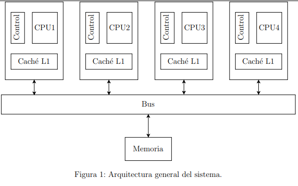

# CpusCacheCoherenceSim

System Overview

MemorySysSimulator es una aplicación de software con interfaz gráfica que modela un sistema multiprocesador con las siguientes características:
1. Sistema con cuatro procesadores.
2. Cada procesador tendrá una memoria caché local L1 con 4 bloques.
3. Estos procesadores se encuentran conectados a una memoria por medio de un bus.
4. La memoria caché L1 es mapeada de forma asociativa por set one-way.
5. Cada procesador deberé generar solicitudes de procesamiento o acceso a memoria (lectura
o escritura) a diferentes regiones de memoria de forma aleatoria.

[System Architecture Overview](docs/architecture.png)

This project was generated with [Angular CLI](https://github.com/angular/angular-cli) version 14.1.2.

## Development server

Run `ng serve` for a dev server. Navigate to `http://localhost:4200/`. The application will automatically reload if you change any of the source files.
