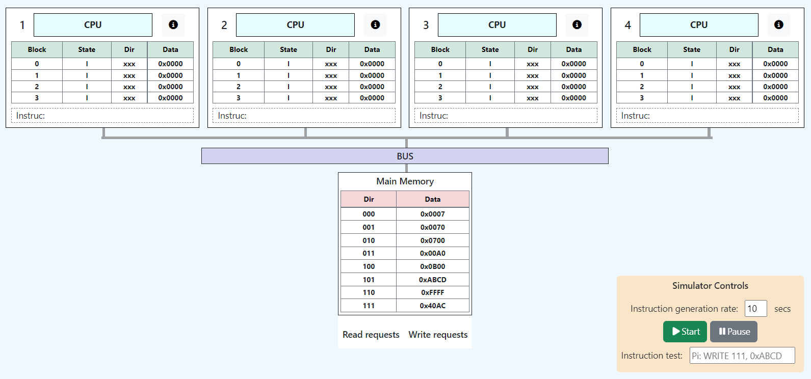
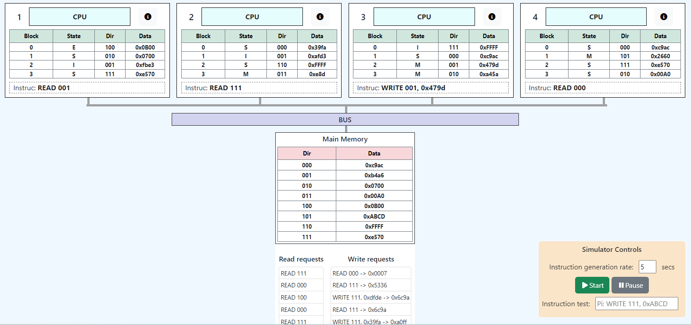
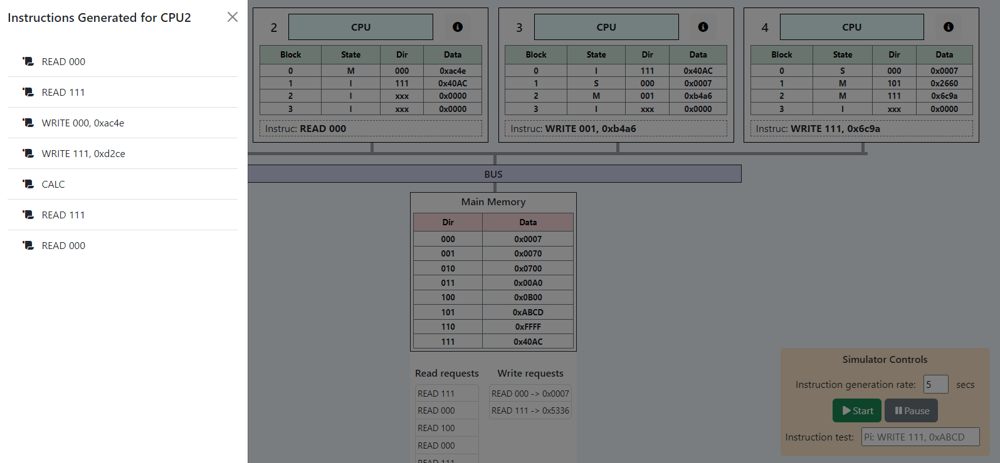

# CpusCacheCoherenceSim

System Overview

MemorySysSimulator es una aplicación de software con interfaz gráfica que modela un sistema multiprocesador con las siguientes características:
1. Sistema con cuatro procesadores.
2. Cada procesador tendrá una memoria caché local L1 con 4 bloques.
3. Estos procesadores se encuentran conectados a una memoria por medio de un bus.
4. La memoria caché L1 es mapeada de forma asociativa por set one-way.
5. Cada procesador deberé generar solicitudes de procesamiento o acceso a memoria (lectura
o escritura) a diferentes regiones de memoria de forma aleatoria.

Modelo del sistema multiprocesador:
  Se crea una instancia del procesador de manera independiente para operar de forma paralela (mediante web workers).
  Cada procesador genera instrucciones individualmente y de manera simultánea junto con los demás procesadores.
  Cada una de las instrucciones se genera utilizando una distribución de probabilidad formal de Poisson.

Una instrucción generada debe tener los siguientes componentes:
  Número de procesador.
  Operación: read, write y calc.
  En el caso de write se indica la dirección de memoria (binario) y el dato aescribir (hexadecimal), respectivamente.
Una instrucción tiene el siguiente formato de ejemplo:
  P0 : READ 0100
  P1 : CALC
  P3 : WRITE 1010;4A3B
  P4 : CALC
 
 Modelo de memoria principal:
La memoria principal es unificada y compartida, comunicándose con los procesadores mediante un único bus. 
Las funciones del modelo memoria principal serán:
1. Actualiza el contenido compartido de los bloques en escrituras (según política de write back).
2. Permite la visualización de los 8 bloques en todo momento.
El sistema simula las condiciones propias de pared de memoria. Tiene un retardo propio de lectura o escritura a memoria, cuando corresponda. 
Al iniciar la aplicación, el contenido de los bloques de memoria son 0. Cada bloque es de 16 bits y debe ser representado en hexadecimal.

Modelo de memoria caché y sistema de coherencia
Cada procesador tiene su caché L1, se pueden almacenar 4 bloques en cada una y posee correspondencia asociativa por set one-way.
Esta memoria sirve para almacenar cuatro bloques que requiera el procesador. La información que debe contener es:
Número de bloque.
Estado de coherencia: M (modificado), S (shared), I (inv´alido), E (exclusive).
Dirección de memoria.
Dato de 16 bits en hexadecimal.
Adicional al modelo de la caché, implementa un modelo del sistema de coherencia, dentro del controlador, que asegura la coherencia entre todas las cachés. El modelo 
incorpora una política de invalidación para las cachés de los demás procesadores. Ante una actualizaci´on en alguna cach´e, o un miss por invalidaci´on, el sistema de coherencia deber´a controlar
la lectura del bloque correspondiente desde memoria principal, y la escritura hacia las demás cachés.
El protocolo es de monitoreo MESI. 
Al iniciar la aplicación la caché está fría, es decir, el contenido de los bloques de caché son 0. 
This project was generated with [Angular CLI](https://github.com/angular/angular-cli) version 14.1.2.

## Development server

Run `ng serve` for a dev server. Navigate to `http://localhost:4200/`. The application will automatically reload if you change any of the source files.
